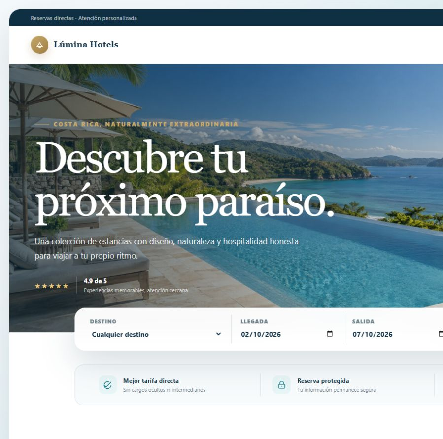
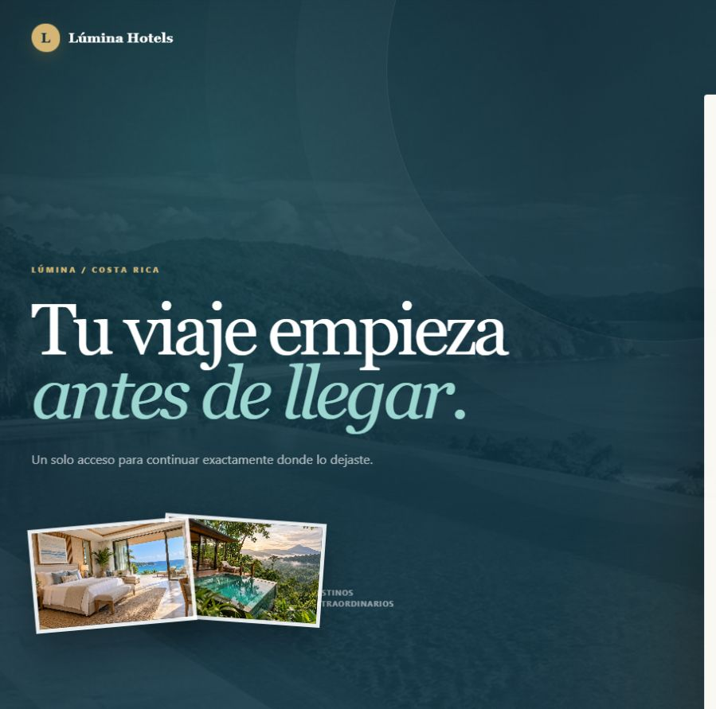
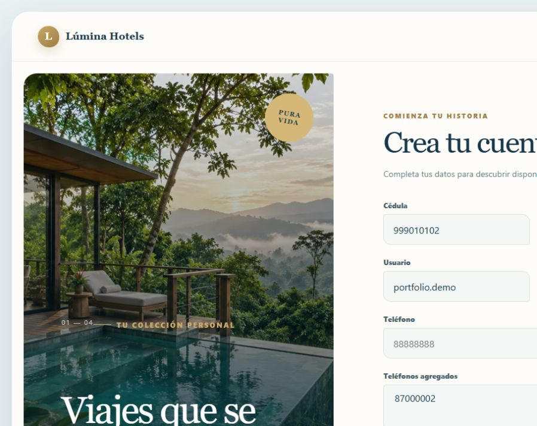
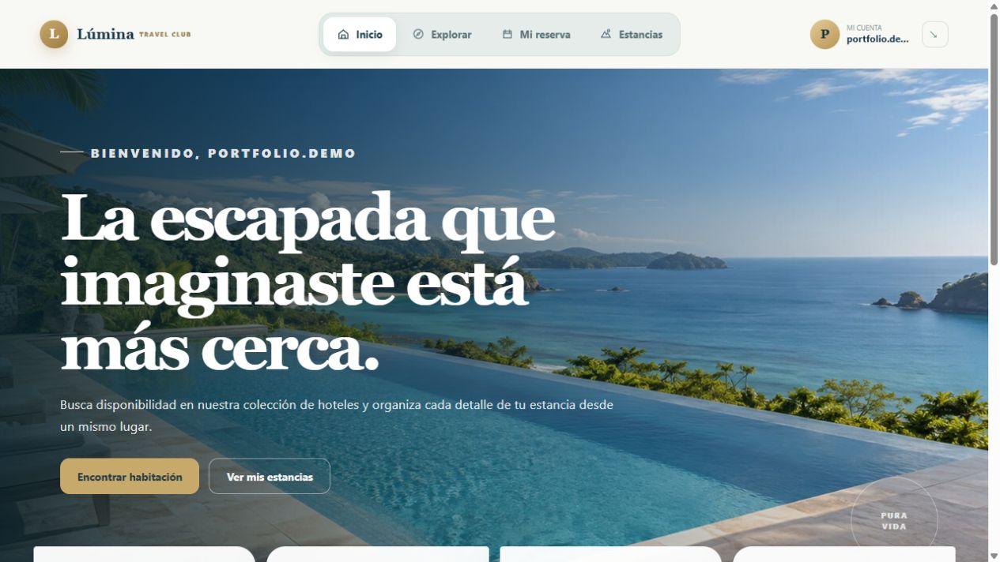
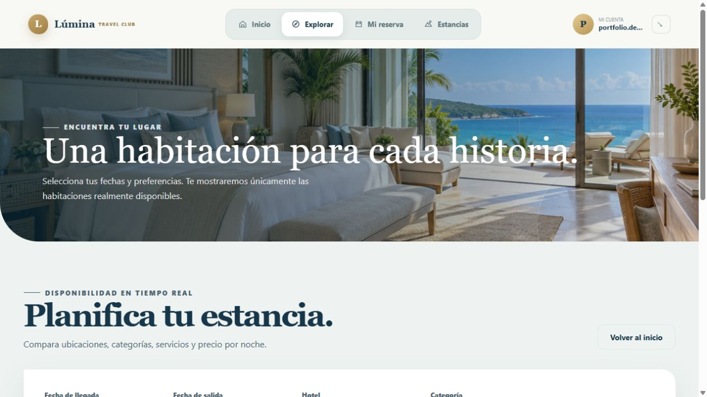
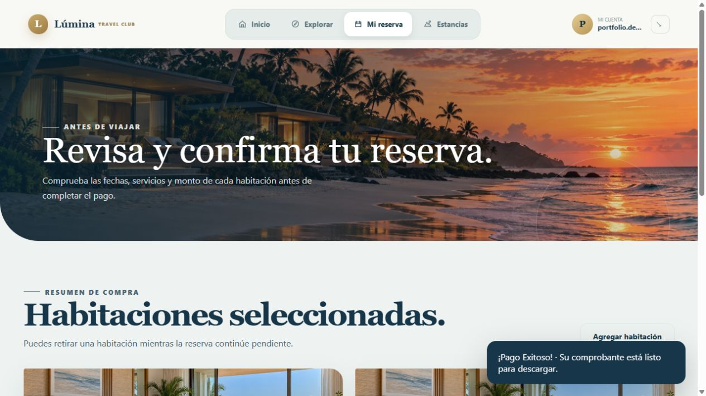
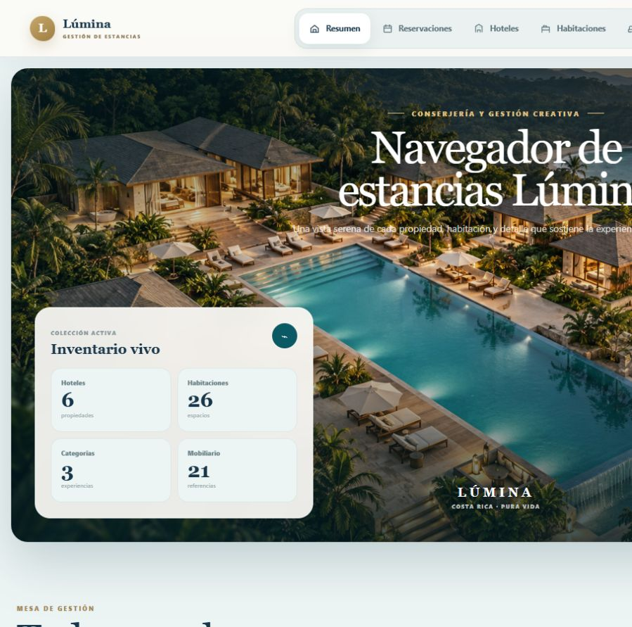
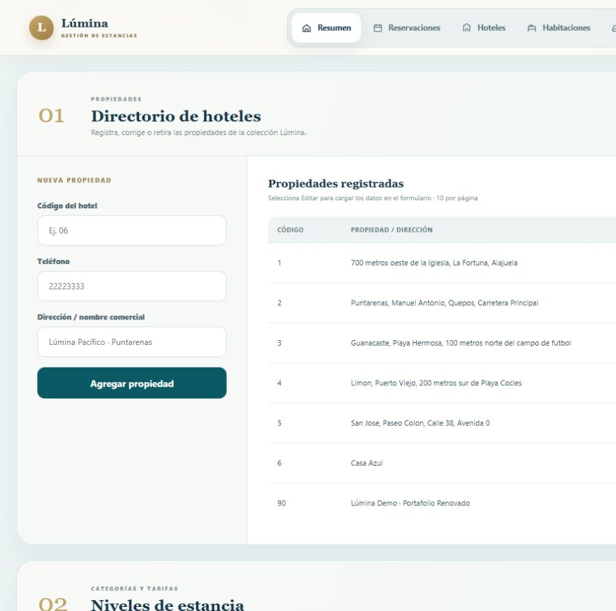
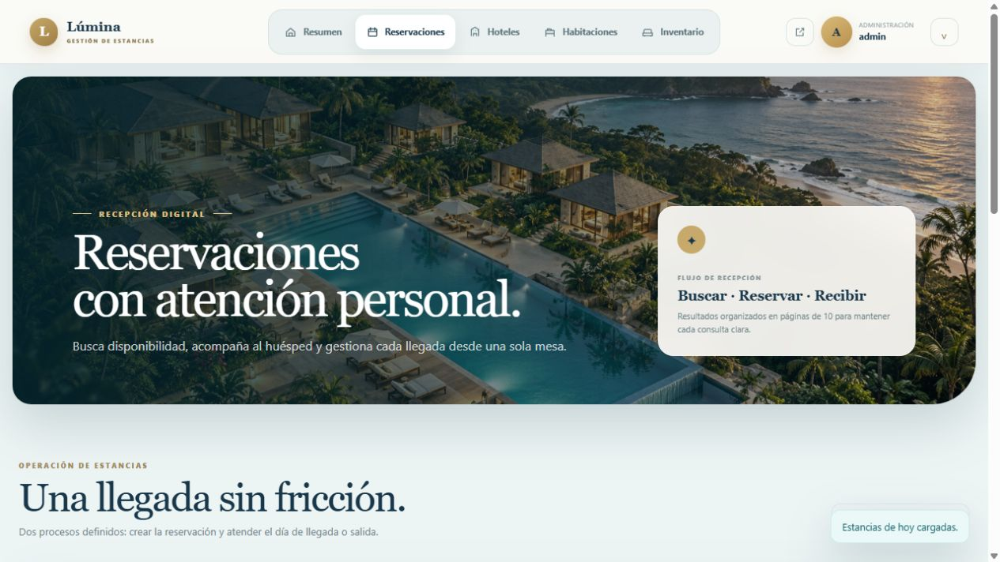
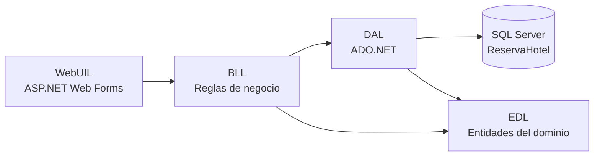

# Lúmina Hotels

> Plataforma hotelera full stack para descubrir estancias, reservar habitaciones y administrar la operación desde una experiencia web unificada.




## Sobre el proyecto

Lúmina Hotels transforma un proyecto académico de reservaciones en una experiencia de portafolio con dos espacios conectados:

- Un portal editorial para que el huésped explore, reserve, pague y gestione sus estancias.
- Un centro de operaciones para administrar propiedades, categorías, habitaciones, mobiliario, inventario y recepción.

El acceso es único. Después de validar las credenciales, el sistema identifica el rol y dirige automáticamente al área correspondiente.

## Funcionalidades

| Portal del huésped | Centro de operaciones |
| --- | --- |
| Registro con teléfonos asociados | Resumen operativo con métricas reales |
| Búsqueda por hotel, fecha y categoría | CRUD de hoteles, categorías, habitaciones y mobiliario |
| Reserva, retiro de habitación y pago | Asignación, traslado y retiro de inventario |
| Próximas estancias e historial filtrable | Reservaciones asistidas para clientes |
| Comprobantes PDF | Check-in y check-out |
| Perfil, teléfonos y contraseña | Paginación de 10 registros |

## Recorrido visual

### Experiencia pública y acceso único

| Inicio público | Inicio de sesión | Registro de cliente |
| --- | --- | --- |
|  |  |  |

### Portal del huésped

| Inicio del huésped | Buscar habitaciones |
| --- | --- |
|  |  |

| Pago confirmado | Próximas estancias |
| --- | --- |
|  |  |

### Centro de operaciones

| Panel administrativo | Gestión de hoteles |
| --- | --- |
|  |  |

| Inventario por habitación | Recepción diaria |
| --- | --- |
|  |  |

La galería completa documenta creación, consulta, actualización, filtros, paginación, descargas, traslados, retiros y eliminaciones:

**[Ver las 38 etapas del recorrido funcional](docs/OPERACIONES.md)**

## Arquitectura



| Proyecto | Responsabilidad |
| --- | --- |
| `WebUIL` | Sitio público, autenticación, portal del cliente y administración |
| `BLL` | Validaciones y reglas de reservación |
| `DAL` | Acceso a datos y ejecución de consultas SQL |
| `EDL` | Entidades compartidas entre las capas |

## Tecnologías

- C# y ASP.NET Web Forms
- .NET Framework 4.7.2
- SQL Server y ADO.NET
- HTML5, CSS3 y JavaScript
- IIS Express y Visual Studio 2022
- iTextSharp para comprobantes PDF
- Diseño propio sin frameworks visuales externos

## Diseño

La identidad visual está inspirada en Costa Rica: azul petróleo, agua turquesa, blanco neblina, vegetación profunda y acentos arena. El portal del huésped y la administración comparten marca y paleta, pero mantienen jerarquías distintas según su función.

Las imágenes se sirven localmente desde `WebUIL/Assets/Images`; el proyecto no depende de bancos de imágenes en tiempo de ejecución.

## Puesta en marcha

### Requisitos

- Windows 10 u 11
- Visual Studio 2022 con **Desarrollo de ASP.NET y web**
- .NET Framework 4.7.2 Developer Pack
- SQL Server y SQL Server Management Studio

### Instalación

1. Clona el repositorio.
2. Ejecuta `DB_Hotel.sql` en SQL Server para crear `ReservaHotel` y sus datos iniciales.
3. Concede acceso a la base de datos al usuario de Windows que ejecuta IIS Express.
4. Ajusta la cadena `cnn` en `WebUIL/Web.config` al nombre de tu instancia de SQL Server.
5. Abre `Proyecto_Hotel_PIII.sln` en Visual Studio 2022.
6. Restaura los paquetes NuGet y establece `WebUIL` como proyecto de inicio.
7. Ejecuta con IIS Express usando HTTP.

### Acceso local de demostración

| Usuario | Rol | Contraseña inicial |
| --- | --- | --- |
| `admin` | Administrador | `*Admin01` |

Los clientes pueden registrarse desde la interfaz. Estas credenciales son únicamente para el entorno local de demostración.

## Seguridad

- Las páginas administrativas verifican el rol 1 desde `Admin.Master`.
- El portal del huésped verifica el rol 2 desde `Site.Master`.
- El script público no crea logins personales de SQL Server ni contiene sus contraseñas.
- La conexión usa seguridad integrada de Windows.

Este proyecto conserva por compatibilidad académica el esquema original de contraseñas. En producción se deben almacenar hashes con sal, usar secretos externos a `Web.config`, habilitar HTTPS y aplicar protección contra intentos repetidos.

Más detalles en [Acceso y roles](docs/ACCESO-Y-ROLES.md).

## Validación

El recorrido funcional fue ejecutado en la aplicación real con datos sintéticos:

- Registro, acceso y cierre de sesión por rol.
- Búsqueda, reserva, retiro, pago y generación de comprobantes PDF.
- Consulta y filtros de próximas estancias e historial.
- Actualización de perfil y administración de teléfonos.
- CRUD completo de hoteles, categorías, habitaciones y mobiliario.
- Asignación, reporte, traslado y retiro de inventario.
- Reservación administrativa, check-in, check-out y paginación.
- Limpieza verificada en SQL Server: los registros temporales quedaron en cero.

La evidencia visual completa está en [docs/OPERACIONES.md](docs/OPERACIONES.md).

## Estructura

```text
ReservaHotelara.NET/
├── BLL/                                  # Reglas de negocio
├── DAL/                                  # Acceso a SQL Server
├── EDL/                                  # Entidades
├── WebUIL/                               # Aplicación ASP.NET
│   ├── Assets/Css/                       # Sistema visual
│   ├── Assets/Images/                    # Recursos gráficos locales
│   └── *.aspx                            # Páginas públicas, cliente y admin
├── docs/
│   ├── OPERACIONES.md                    # Recorrido funcional completo
│   └── screenshots/operations/           # Evidencia visual
├── DB_Hotel.sql
└── Proyecto_Hotel_PIII.sln
```

## Autor

Proyecto de portafolio desarrollado por [DreyMor16](https://github.com/DreyMor16).
